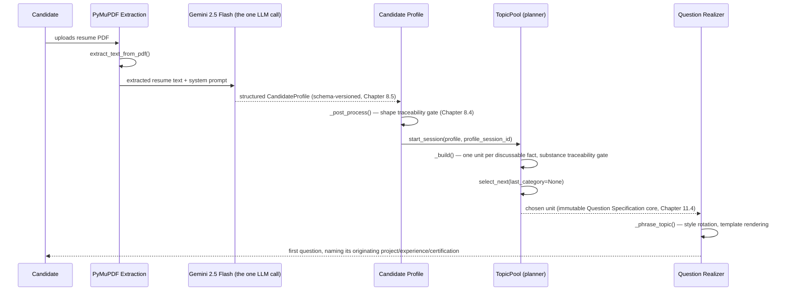
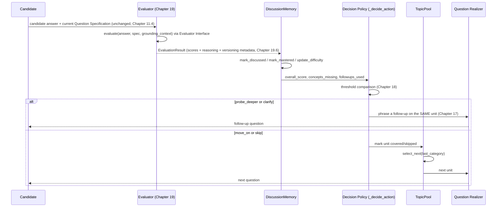
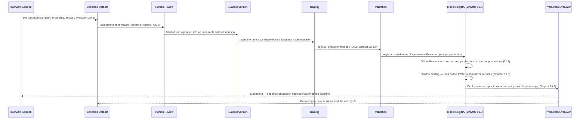

# Resume Discussion — Engineering Specification (v2)

Status: **Approved / Living Source of Truth**
Scope: Resume Parsing, Candidate Profile Generation, Resume Discussion, Evaluation, Explainability, Dashboard.
Out of scope: Technical Interview module (parsed and evaluated by a separate subsystem; referenced here only where Resume Discussion hands off to it).

This document is the permanent engineering specification for the Resume Discussion subsystem. It is written so that an engineer with zero prior context — no memory of design meetings, no access to earlier chat transcripts — can read this document alone and reconstruct the entire subsystem, understand every trade-off that shaped it, and safely extend it. If code and this document ever disagree, that is a bug in one of the two, and this document should be corrected deliberately, not silently outvoted by whatever the code currently does.

Every future change to Resume Parsing, Candidate Profile Generation, Resume Discussion, Evaluation, Explainability, or the Dashboard should begin by reading this document, and should update it if the change alters an architectural decision recorded here.

---

## 1. Vision

Resume Discussion is **not** a technical interview.

A technical interview asks: *"does this candidate know computer science?"* Resume Discussion asks a narrower and, for this product's purpose, more important question: *"did this specific candidate actually do the specific things their resume says they did, and do they understand what they did well enough to talk about it like the person who built it?"*

The interviewer persona is a senior software engineer conducting a resume-grounded discussion — the kind of conversation a hiring manager has before a candidate is even invited to a technical round. That engineer:

- Picks a real line item off the resume — a project, an internship, a certification — and asks about it directly, by name.
- Follows up the way a curious colleague would: "why did you do it that way," "what broke," "what would you change."
- Is not trying to catch the candidate out on textbook trivia ("what is Big-O notation") — general CS knowledge is the Technical Interview module's job, not this one's.
- Is trying to distinguish authentic, first-hand ownership from a memorized bullet point, a copied project, or a resume line that was true of the team but not of this individual.

Every design decision in this document exists in service of that one narrow goal: **verify authenticity, depth of contribution, engineering judgement, and communication — grounded strictly in what this candidate's own resume claims.**

Two corollaries follow directly from this vision and recur throughout the rest of this document:

1. **If it isn't on the resume, Resume Discussion cannot ask about it.** A technology the candidate clearly knows but which their resume doesn't mention in connection with any project or job is out of scope — asking about it would no longer be verifying *this resume*, it would be a general knowledge probe, which is the Technical Interview module's job.
2. **A question that could be asked of any candidate with any resume is a failure of this subsystem.** Every question must be specific enough that it could only have been generated from this particular candidate's particular profile.

---

## 2. Goals

- Verify that resume claims (projects, experience, certifications, and the specific technologies attached to each) reflect genuine, first-hand understanding.
- Conduct a natural, multi-turn conversation that feels like talking to a real senior engineer, not filling out a quiz.
- Adapt in real time to answer quality: probe deeper on strong-but-shallow answers, clarify on weak answers, move on from well-covered ground, and disengage gracefully from a candidate who stops engaging.
- Guarantee full traceability: every question asked must be explainable after the fact — which resume entry produced it, and why it was chosen at that point in the conversation.
- Produce a structured, explainable evaluation of the candidate's performance suitable for a dashboard and for feeding the (separate) Technical Interview module's starting difficulty.
- Do all of the above with an architecture that can absorb better ML models over time (heuristic → pretrained → fine-tuned) without changing any external interface: the Flask routes, the session lifecycle, and the dashboard's data contract must all stay stable across that evolution.
- Minimize paid LLM API usage to the theoretical floor: **one** call per candidate.

## 3. Non-goals

- **Not** a general technical-knowledge interview. Computer-science fundamentals unconnected to a specific resume claim belong to the Technical Interview module.
- **Not** a coding assessment. No code is written or executed during Resume Discussion.
- **Not** a lie detector. The contradiction flag (Chapter 19) surfaces a *signal* for a human reviewer or downstream scoring; it does not unilaterally fail a candidate.
- **Not** a generative-question system. Question wording is templated and deterministic (Chapters 10–12); this is a design decision, not a placeholder for "add an LLM later."
- **Not** a system that re-reads the resume text. Once the Candidate Profile exists, the raw resume is dead to every downstream module (Chapter 8).
- **Not** responsible for Technical Interview content, scoring, or UI. Resume Discussion may hand off a starting difficulty and coverage summary to that module, but does not implement it.

## 4. Functional Requirements

FR1. Given a Candidate Profile, the system must be able to start a Resume Discussion session and produce a first question without any further LLM calls.

FR2. Every question presented to the candidate must be traceable to exactly one Candidate Profile entry (a project, an experience entry, a certification, or a skill cited *within* one of those).

FR3. The system must accept a free-text answer, evaluate it locally, and decide one of: probe deeper, ask a clarifying follow-up, move to a new topic, skip the current topic (disengagement), or end the session.

FR4. The system must never ask the same question twice, and must never ask two questions that are semantically near-duplicates within a session.

FR5. The system must guarantee that, before a session is allowed to end at its soft target length, every category of discussion material actually present on the profile (projects, experience, certifications, in-context skills) has been touched at least once.

FR6. The system must produce, at the end of a session, a structured summary suitable for a dashboard: per-turn scores, aggregate scores, projects discussed, technologies demonstrated vs. not demonstrated, concepts mastered vs. needing review, a resume-authenticity signal, and free-text personalized feedback.

FR7. The system must expose the underlying reasoning for every score (Explainability, Chapter 20) — a raw number with no justification is treated as a defect, not an acceptable output.

FR8. Resume Parsing → Candidate Profile Generation must occur in **exactly one** Gemini API call per candidate (with a narrowly-scoped automatic retry only for the specific "zero skills extracted" failure mode — see Chapter 8).

## 5. Non-functional Requirements

NFR1. **Cost**: at most one paid LLM call per candidate, end to end, across parsing, profile generation, discussion, and evaluation. (The one narrowly-scoped retry in Chapter 8 is a reliability exception, not a second logical call.)

NFR2. **Latency**: every Resume Discussion turn (question selection, phrasing, answer evaluation, next-question decision) must complete without a network call, bounded by local model inference time only (SBERT/KeyBERT/NLI on CPU, sub-second per turn on commodity hardware).

NFR3. **Determinism where it matters**: question *planning* (what to ask) must be fully deterministic and reproducible from a given profile + conversation history: no LLM, no hidden randomness that affects *what* topic is chosen (controlled randomness for tie-breaking and phrasing variety is acceptable and documented in Chapters 10–12).

NFR4. **Explainability**: every scored dimension must be reconstructable from inputs a human can inspect (the answer text, the grounding facts, the extracted keyphrases) — no black-box scores without a `reasoning` trail.

NFR5. **Extensibility without interface breakage**: swapping the evaluator from heuristic → pretrained → fine-tuned must not change the shape of `EvaluationResult`, the Flask route contracts, or the dashboard's expected JSON (Chapter 19).

NFR6. **Statelessness of the resume**: no module downstream of Candidate Profile Generation may hold a reference to, or re-derive information from, the raw resume text or PDF.

NFR7. **Graceful degradation**: if an optional local model (SBERT, KeyBERT, NLI) fails to load, the system must fall back to a lexical heuristic rather than crashing the session (see the `_get_sem_model`/`_get_keybert_model`/`_get_nli_model` lazy-singleton pattern).

## 6. Architecture Overview

```
┌──────────────┐     ┌───────────────────┐     ┌─────────────────────┐
│  Resume PDF  │ --> │  PyMuPDF text      │ --> │  Gemini 2.5 Flash    │
│              │     │  extraction        │     │  (THE ONLY LLM CALL)│
└──────────────┘     └───────────────────┘     └──────────┬───────────┘
                                                            │
                                                            v
                                                ┌───────────────────────┐
                                                │   Candidate Profile    │
                                                │ (Pydantic → dict, the  │
                                                │  ONLY source of truth) │
                                                └──────────┬─────────────┘
                                                            │
                        ┌───────────────────────────────────┼─────────────────────────────┐
                        v                                    v                             v
              ┌──────────────────┐               ┌────────────────────┐          ┌─────────────────┐
              │   Dashboard       │               │  Resume Discussion  │          │ Technical        │
              │ (profile-derived) │               │  (this document)    │          │ Interview        │
              └──────────────────┘               └──────────┬───────────┘          │ (separate module,│
                                                              │                      │  out of scope)   │
                                                              v                      └─────────────────┘
                                                  ┌───────────────────────┐
                                                  │ 1. TopicPool           │  deterministic planner
                                                  │ 2. Question Realizer   │  local templated NLG
                                                  │ 3. Local Evaluator     │  SBERT + KeyBERT + NLI
                                                  │ 4. Decision Policy     │  threshold policy over
                                                  │                        │  the evaluator's signal
                                                  └───────────────────────┘
```

All four Resume Discussion components run **entirely locally** — no network call, no Gemini, no external API — for the whole lifetime of a session. This is Non-Negotiable Principle 1 (Chapter "Non-Negotiable Architecture Principles" is folded into the relevant chapters below; see especially Chapters 8–10 and 19).

## 7. Complete Data Flow

1. **Upload**: candidate uploads a resume PDF.
2. **Extraction**: `extract_text_from_pdf` (PyMuPDF) converts it to plain text, with a block-based reading-order fallback for multi-column layouts (`_needs_block_fallback` / `_extract_blocks_ordered`).
3. **Profile generation (the one Gemini call)**: `generate_candidate_profile` sends the extracted text plus a system prompt to Gemini 2.5 Flash with a Pydantic `response_schema` (`CandidateProfile`), so the model is constrained to return exactly this structure. If the returned profile has zero skills — a well-known extraction failure mode — a single, narrowly-scoped retry is issued with a more explicit extraction prompt. This is the *only* place the raw resume text is read anywhere in the system.
4. **Post-processing**: `_post_process` normalizes domain/experience-level labels, clamps confidence, deduplicates string lists, and — critically — **drops any `technical_topics` entry that doesn't cite exactly one origin** (a project XOR an experience entry). This is the first of two traceability gates; the second happens in the TopicPool (step 6).
5. **Persistence**: the resulting `CandidateProfile` dict is stored against a `profile_session_id` and becomes the only artifact every downstream module reads. The PDF and extracted text are not retained for discussion purposes.
6. **Resume Discussion start**: `discussion_engine.start_session(profile, profile_session_id)` builds a `TopicPool` (Chapter 10) from the profile — this is where the second traceability gate lives: any `technical_topics` entry whose cited project/experience doesn't actually exist on *this* profile is rejected outright (kept in `TopicPool.rejected` for diagnostics) rather than asked about.
7. **Turn loop**: for each turn, the `TopicPool` selects a unit, the Question Realizer phrases it, the candidate answers, the Local Evaluator scores the answer, and the Decision Policy chooses the next action (probe / clarify / move on / skip). This repeats until the soft/hard question-count ceilings are reached *and* every present category has been covered at least once.
8. **End of session**: `end_session` aggregates all per-turn scores into the dashboard payload (Chapter 21) and discards the in-memory session.

No step after step 3 ever contacts an external API. No step after step 6 ever reads the raw resume text — everything is derived from the Candidate Profile dict and the in-session `DiscussionMemory`/`TopicPool` state.

### 7.1 Sequence diagram — resume to first question



No step after `Gemini 2.5 Flash` in this diagram ever calls an external API again — everything from `TopicPool` onward runs locally, per Non-Negotiable Principle 1.

## 8. Candidate Profile

### 8.1 Why exactly one Gemini call

Every additional LLM call in a per-candidate pipeline multiplies cost and latency and introduces a new point of non-determinism. The design collapses resume understanding into a single call by asking Gemini to produce not just flat fields (name, skills, education) but also the **interview-relevant structure** Resume Discussion needs: `interview_blueprint.technical_topics` (each with an `originating_project` or `originating_experience` and an `evidence` quote), `interview_seeds` per project, `estimated_strengths`, and `estimated_weaknesses`. Gemini is uniquely well-suited to this because it can read unstructured resume prose and produce structured, grounded claims about it; nothing downstream needs to touch an LLM again because everything downstream needs is already in the profile.

The single narrow exception is the "zero skills" retry: if the primary call returns an empty skills list — almost always a genuine extraction failure rather than a candidate who truly lists no skills — a second call re-prompts with an explicit extraction instruction. This is treated as a **reliability retry for a known failure mode**, not a second logical call in the pipeline; it does not recur once skills are non-empty, and it does not happen on every candidate.

### 8.2 Why the Candidate Profile is the only source of truth

Once the Candidate Profile exists, it is the *complete* and *final* representation of what the candidate claims. Every module after profile generation — Dashboard, Resume Discussion, Technical Interview — consumes this dict and never the resume again. This has three benefits:

- **Consistency**: the Dashboard, the Discussion, and the Interview can never disagree about what a candidate's resume said, because they all read the same structured facts.
- **Cost**: no module needs its own LLM call to re-derive facts from prose.
- **Testability**: the Candidate Profile schema (a Pydantic model) is a stable, inspectable contract. Unit tests for Resume Discussion can construct a profile dict by hand and never touch Gemini or a PDF.

### 8.3 Schema summary

`CandidateProfile` (see `candidate_profile_generator.py`) contains: `candidate_name`, `contact_details`, `skills`, `education[]`, `experience[]` (`company`, `role`, `duration`, `summary`), `projects[]` (`title`, `summary`, `technologies[]`, `concepts[]`, `interview_seeds[]`), `certifications[]`, `predicted_domain`, `experience_level`, `confidence`, `resume_summary`, and `interview_blueprint` (`resume_verification_topics[]`, `technical_topics[]`, `starting_difficulty`, `estimated_strengths[]`, `estimated_weaknesses[]`).

`TechnicalTopic` (an entry of `interview_blueprint.technical_topics`) is the schema element built specifically for Resume Discussion's traceability requirement: `topic` (a *specific*, demonstrated concept, never an abstract CS subject), `originating_project` XOR `originating_experience` (exactly one must be set), and `evidence` (a literal phrase from the resume). The system prompt is explicit that Gemini must *omit* a topic entirely rather than invent an origin for it — "an empty list is correct if nothing qualifies" is stated directly in the prompt.

### 8.4 Why traceability is enforced twice

`_post_process` enforces the *shape* invariant (exactly one origin field set, non-empty topic) immediately after the Gemini call, because a profile with a malformed `technical_topics` entry should never be persisted at all. The `TopicPool` enforces the *substance* invariant (does the cited origin actually exist among *this* profile's `projects`/`experience`?) at discussion-build time, because that check requires the full profile for cross-referencing, which `_post_process` (validating one field in isolation) does not have. Two gates, two different failure modes, deliberately not merged into one.

### 8.5 Candidate Profile schema versioning

The Candidate Profile schema has already changed once (`technical_topics` moved from plain strings to structured `TechnicalTopic` objects — Chapter 8.3, Chapter 22.4) and will change again as this specification's requirements evolve. Every persisted Candidate Profile must therefore carry an explicit `schema_version` field (e.g. `CandidateProfileSchemaVersion: "v1"`), stamped at generation time and never inferred after the fact by guessing from which fields happen to be present.

**Why this is architecturally necessary, not optional polish:**

- **Backward compatibility.** A downstream module reading a profile must be able to tell, before touching a single field, whether it's looking at a shape it understands. A profile stamped `v1` can be read by `v1`-aware code without any ambiguity; a profile stamped `v2` signals that new or restructured fields may be present, so `v1`-only code can fail loudly or fall back gracefully instead of silently misreading a restructured field as if it were the old shape.
- **Session replay.** Resume Discussion sessions are, by design, fully reconstructable from a Candidate Profile plus a conversation history (Chapters 7, 11, 22). Replaying an old session — for debugging, for an audit, or for regenerating training data (Chapter 22) — requires knowing exactly which profile shape produced it; without a version stamp, a replay tool has no reliable way to distinguish "this field is empty because the candidate had nothing to put there" from "this field didn't exist yet in the schema version this session ran against."
- **Old interview history.** A candidate's dashboard and stored session history must remain readable indefinitely, even after the schema has moved on to `v2` or `v3`. Versioning is what makes it possible to keep old profiles and old sessions exactly as they were, rather than requiring every historical record to be silently and irreversibly rewritten (or discarded) the moment the schema changes.
- **Future field additions.** Adding a new field to `CandidateProfile` (or to `TechnicalTopic`, `ProjectEntry`, etc.) is routine evolution, not a breaking change, as long as the version stamp changes alongside it — code that consumes the profile can check the version and use the new field only when it's known to be present, rather than assuming every profile in the system already has it.
- **Migration.** A version stamp is the precondition for writing an explicit, testable migration function (`v1 -> v2`, `v2 -> v3`, ...) rather than an ad hoc, best-effort field-by-field guess. A migration path only needs to exist between adjacent versions; a profile many versions old can be brought forward one step at a time, the same discipline already used for dataset versions (Chapter 22.4) and model versions (Chapter 19.7).

**Consequence for this document's other versioning disciplines**: `schema_version` on the Candidate Profile is the same category of fact as `evaluator_version`/`model_version`/`dataset_version` on an `EvaluationResult` (Chapter 19.6–19.7) — a permanent, load-bearing piece of provenance metadata, not incidental logging. A future Candidate Profile must remain readable after the schema evolves for exactly the reason a future `EvaluationResult` must remain attributable after the evaluator evolves: both are permanent records that outlive the code that produced them.

## 9. Resume Discussion

Resume Discussion is the conversational engine that turns a Candidate Profile into a multi-turn, adaptive, evaluated discussion. It has exactly four components, and understanding why there are four — not one, not two — is the core of this chapter.

**Component 1 — TopicPool (Chapter 10)**: an adaptive pool of discussion units built once from the profile. It decides *what* to discuss, in what priority, and never in a fixed sequence.

**Component 2 — Question Realizer (Chapters 11–12)**: converts a chosen unit into natural interview-question English. It never decides *what* to ask, only *how to phrase* what the planner already chose.

**Component 3 — Evaluator (Chapter 19)**: scores a candidate's answer against the grounding facts of the current unit, through a stable Evaluator Interface (Chapter 19.2) that the rest of the system calls without knowing or caring which implementation is behind it. The implementation currently registered as production (Chapter 19.10, "Evaluator V1") uses pretrained (not fine-tuned) local models: SBERT for semantic relevance, KeyBERT for concept coverage, and an NLI cross-encoder used narrowly as a contradiction flag — but this is one interchangeable implementation, not the architecture itself.

**Component 4 — Decision Policy (Chapter 18)**: a transparent threshold policy over Component 3's score that chooses probe deeper / clarify / move on / skip / finish.

The separation between Components 1 and 2 (planning vs. phrasing) and between Components 3 and 4 (measurement vs. decision) is the single most load-bearing design choice in this subsystem, and it recurs as the justification for nearly every other decision in this document (see especially Chapters 10, 12, and 19).

## 10. Question Planning

**Question planning is fully deterministic. It is not, and must never become, a language model.**

### 10.1 Why deterministic planning was chosen over an LLM planner

An LLM planner (e.g., "ask Gemini what to ask next given the conversation so far") was considered and rejected for this system, for three concrete reasons:

1. **Traceability collapses.** An LLM asked to "pick something interesting to ask about" cannot reliably guarantee that its choice traces back to exactly one Candidate Profile entry — it will paraphrase, blend two projects, or invent connections that sound plausible but aren't grounded. Traceability (FR2, Chapter 16) is a hard requirement, not a nice-to-have; a system that can't guarantee it 100% of the time has failed at its core purpose.
2. **Cost and latency.** Every turn would require a network round-trip, directly violating Non-Negotiable Principle 1 (Chapter 4, NFR1/NFR2) that discussion runs entirely locally after the one profile-generation call.
3. **Reproducibility for testing and auditing.** A deterministic planner given the same profile and the same conversation history always proposes the same *set* of viable next topics (modulo the intentionally-scoped randomness described in §10.3). This makes the planner's behavior something that can be unit-tested exhaustively; an LLM planner's behavior can only be sampled and hoped to be representative.

### 10.2 Why creativity is explicitly not a goal here

It might seem like a planner that can be "creative" about connecting resume facts would produce a richer interview. In this system's vision (Chapter 1), creativity in *what* to ask is a liability, not a feature: the entire point is to verify specific, literal claims on the resume. A planner that infers "you used Redis in Project A and PostgreSQL in Project B, so let's discuss how you'd combine them" has stopped verifying the resume and started inventing a scenario the candidate never claimed to have handled. Grounding beats cleverness here, categorically.

### 10.3 What the planner actually does — TopicPool

`TopicPool._build(profile)` (see `discussion_engine.py`) walks the Candidate Profile once, at session start, and emits one **unit** per discussable fact, tagged with a strict priority tier:

| Tier | Category | Source | Rationale |
|---|---|---|---|
| 5 (highest) | `project_deep_dive` | a project's own `interview_seeds` | Gemini already scoped these to a specific project during profile generation — the richest, most specific material available. |
| 4 | `project_overview` | a project's `summary`/`technologies` | "What did you build and why" for every project, even one with no specific seeds. |
| 3 | `experience` | an `experience[]` entry's `role`/`company`/`description` | Internship/work history — real responsibility, not a personal project. |
| 2 | `certification` | `certifications[]` | Lower priority: certifications say less about hands-on contribution than a project or job. |
| 1 (lowest) | `skill_in_context` | a `technical_topics` entry — **only if it resolves to a real project or experience entry on this profile** | A technology is never interesting on its own; it's interesting because of where it was used. |

`select_next(last_category)` is called every time the Decision Policy says "move on" — never precomputed as a fixed sequence. It scores every still-`unasked` unit by: tier weight (dominant factor) → a large one-time "coverage sweep" bonus for any category not yet touched this session (so a project with a dozen `interview_seeds` cannot consume the entire question budget before experience/certifications are ever reached) → a small boost for units touching a profile-estimated weakness → a small category-diversity tie-break against the immediately preceding category → a small random jitter purely to keep repeated sessions on the same profile from feeling scripted. Every selection, and every rejected alternative, is logged with its score and the specific reason it lost — this log is itself part of the traceability guarantee (Chapter 16): a reviewer can reconstruct not just *what* was asked but *why that and not something else*.

### 10.4 Why an adaptive pool instead of a fixed sequence

An earlier design considered building a fixed, ordered question list up front (e.g., "project 1, then project 2, then experience, then certifications"). This was rejected because a fixed sequence cannot react to what has already happened in the conversation: if a candidate gives an exceptionally strong answer early and the Decision Policy wants to probe deeper, a fixed sequence has no room to insert that follow-up without either skipping something else or breaking the plan. The pool model — units that exist independently and are *selected from*, never *stepped through* — lets follow-ups, skips, and the coverage sweep all coexist with the same priority logic, because selection happens fresh every turn rather than by advancing an index.

## 11. Question Specification

Every unit the TopicPool produces is a complete **Question Specification** — the structured contract between the planner (Component 1) and the realizer (Component 2). Nothing about *what* the question is may live only in generated English; if it isn't captured in the specification, it doesn't exist for traceability, evaluation, or dashboard purposes.

### 11.1 Schema

```python
{
    "id": "topic_7",                       # stable identity within this pool
    "category": "project_deep_dive",       # one of the 5 tiers in Chapter 10.3
    "text_seed": "Redis caching strategy",  # the raw seed/subject, pre-phrasing (None for overview/experience/cert units)
    "grounding": {                          # the actual profile sub-object(s) this question must stay faithful to
        "project": { "title": "...", "summary": "...", "technologies": [...], "concepts": [...] }
        # or {"experience": {...}} or {"certification": {...}}
    },
    "status": "unasked",                    # unasked | active | covered | skipped
    "followups_used": 0,                    # 0..2, caps probing depth on one unit (see Chapter 17)
    "priority_boost": True,                 # True if this touches an estimated_weakness
    "source_type": "project",               # project | experience | certification — the provenance tag (Chapter 16)
    "source_id": "Adaptive Interview Platform",  # the exact project title / "role at company" / cert name
    "source_field": "interview_seeds",       # which Candidate Profile field produced this unit
    "reason": "projects[title='Adaptive Interview Platform'].interview_seeds",  # human-readable justification
    "style_used": "tradeoffs",              # set once phrased — which phrasing style/angle was used (Chapter 12)
}
```

### 11.2 Field-by-field rationale

- **Project / experience / certification identity** lives in `source_id` + `grounding`, never inferred from the phrased question text — because phrased text is deliberately varied (Chapter 12) and must never be the system of record for *what* was asked about.
- **Intent** is implicit in `category` + `text_seed`: a `project_deep_dive` unit's intent is "verify this specific claimed detail"; a `project_overview` unit's intent is "verify general ownership of the project as a whole."
- **Focus / Expected Concepts**: derived on demand from `grounding["project"]["concepts"]`/`["technologies"]`, scoped per-question by `_relevant_terms` (Chapter 19.4) rather than stored statically on the unit — because "what's relevant" depends on which follow-up angle is active, not just on which project this is.
- **Conversation Context** is not stored on the unit at all; it lives in `DiscussionMemory` (Chapter 13) and is passed alongside the unit when the Realizer needs it (e.g., `recent_styles` for style rotation, `last_category` for diversity scoring).
- **Reasoning Type**: the phrasing **style** (`style_used`, set at realization time) doubles as the reasoning-type signal for a given turn — see Chapter 16 for why difficulty-band labels were rejected in favor of this.
- **Source Metadata / Selection Reason**: `source_type`, `source_field`, and `reason` together are the full audit trail — enough for a human or a test to answer "why was this question asked, and from where in the resume did it come" without re-running the selection algorithm.
- **Priority**: `priority_boost` (weakness-touching) plus tier (`category`) fully determine priority; there is no separate numeric priority field because a derived score (`TopicPool.select_next`'s internal `score()`) is recomputed fresh every turn, not cached on the unit — caching it would go stale the moment `covered_categories` changes.
- **Coverage Status**: `status` (`unasked`/`active`/`covered`/`skipped`) is the single field the coverage guarantee (`TopicPool.all_categories_covered`, Chapter 15) reads.
- **Dependencies**: a `project_deep_dive`/`project_overview` unit's only dependency is its own `grounding["project"]` existing on the profile — enforced at `_build` time, so a malformed/unresolvable unit is simply never created (see `skill_in_context`'s rejection path, §10.3, which is the most visible example of a dependency check).

### 11.3 Concrete example — a rejected unit

Not every candidate `technical_topics` entry becomes a unit. If Gemini's `originating_project` doesn't match any title in `projects` (a hallucination, a typo, or a project the candidate later removed), the entry is rejected rather than asked about:

```python
{
    "topic": "GraphQL federation",
    "originating_project": "Order Management System",   # no such project on this profile
    "originating_experience": "",
    "reason": "no matching project or experience entry on this profile",
}
```

This is logged and retained in `TopicPool.rejected` purely for diagnostics and tests — it is never surfaced to the candidate and never contributes a question.

### 11.4 Immutability of the Question Specification

Once the planner creates a Question Specification, its **provenance core** — `id`, `category`, `text_seed`, `grounding`, `source_type`, `source_id`, `source_field`, and `reason` (§11.1–11.2) — is permanent for the lifetime of the session. No downstream component is permitted to modify it:

```
   Planner (TopicPool, Chapter 10)
          │
          v
   Question Specification (immutable provenance core)
          │
          v
   Question Realizer (Chapter 12)  ──  reads, phrases, never rewrites
          │
          v
   Evaluator (Chapter 19)  ──  reads, scores, never rewrites
          │
          v
   Dashboard (Chapter 21)  ──  reads, renders, never rewrites
```

The Question Realizer reads the specification to produce phrasing; it does not get to change *what* the specification says it's about (Chapter 12's planning/phrasing separation is precisely this guarantee, restated as an immutability rule). The Evaluator reads the specification's grounding to score an answer; it does not get to reinterpret or narrow what the specification claims to be grounded in beyond the per-question scoping already documented in Chapter 19.4. The Dashboard reads the specification to render traceability information; it performs no independent interpretation. **The Question Specification is the permanent record of why a question existed, and that record must still be true, unchanged, after the session ends** — this is what makes it trustworthy as the traceability guarantee's evidence (Chapter 16), and what makes it usable, unmodified, as a training-data field later (Chapter 22.3).

**Why immutability matters here, concretely:**

- **Traceability**: the entire traceability guarantee (FR2, Chapter 16) depends on being able to ask, at any point after a question was asked, "what did this question's provenance actually say when it was created?" A specification that could be edited after creation would make that question unanswerable with confidence — a bug that silently touched the wrong field could rewrite history along with the present.
- **Reproducibility**: Chapter 10's determinism guarantee (NFR3) only holds if the specification a given turn's decision was made against is fixed; a specification that changed underneath a decision would make "the same profile + the same history produces the same output" unverifiable, because there would be no way to know which version of the specification a past decision actually saw.
- **Debugging**: when a session behaves unexpectedly, the first question is almost always "what did the planner actually intend here?" An immutable specification means that question always has one unambiguous answer, recoverable from the stored record itself, rather than requiring a reconstruction of possibly-overwritten state.
- **Testing**: unit tests for the Realizer, the Evaluator, and the Dashboard can each be written against a fixed, hand-constructed Question Specification fixture with confidence that nothing else in the pipeline could have altered it before the test's own assertions run — a foundational assumption for the entire testing strategy in Chapter 25.
- **Future dataset generation**: Chapter 22.3's training data schema stores `context` (the grounding) verbatim from the Question Specification. That is only a trustworthy training signal if the grounding a labeled answer is checked against is guaranteed to be the exact grounding the candidate was actually asked about — not a value that could have drifted between question-time and label-time.

**A note on today's implementation**: as implemented, `status`, `followups_used`, and `style_used` (§11.1) are session-lifecycle *annotations* recorded on the same dict object as the provenance core, for implementation convenience — `TopicPool` advances `status`/`followups_used` as the conversation proceeds, and the Question Realizer records `style_used` once phrasing happens. These are not violations of the immutability principle: they track *what has happened to* a unit over the course of a session, not *what the unit fundamentally is*. The provenance core itself — the fields that answer "why does this question exist" — is written exactly once, at creation, and never rewritten by any of these updates. A future refactor that wants to make this separation structurally explicit (e.g., storing lifecycle/annotation state in a separate `RealizationRecord` keyed by specification `id`, rather than as in-place fields on the same object) would be a welcome clarification of this principle, not a change to it.

## 12. Question Realizer

The Question Realizer's **only** job is phrasing. It receives a fully-decided Question Specification and produces natural English; it never decides what the question is about, and it must never be able to override the planner's choice of subject.

### 12.1 Why templates, not a generative rewrite step

An earlier version of this component used FLAN-T5-small to rewrite a grounded statement into a question, with templates only as a fallback. In practice, FLAN-T5-small consistently produced the *opposite* of a senior-engineer-quality question: bare "What is X?" definitional drift, dropped entities, and near-echoes of the input, even after several rounds of output quality-gating. The fallback templates that actually fired in production were themselves terse and topic-label-like ("On {title} — {seed}"), which is exactly the flat, quiz-like tone this subsystem exists to avoid (Chapter 1).

Given that the priority is *consistently* natural, conversational, senior-engineer-style phrasing, well-crafted templates were kept as the **primary and only** phrasing path. This is a deliberate trade of "a model could in theory produce something novel" against "templates can be engineered directly to the exact target quality bar, every single time, with zero risk of degenerating into a flat definitional question." Given the failure mode was systemic rather than occasional, the trade favors templates without qualification.

### 12.2 Question families and variation

Each category has a small set of **styles** (angles a senior engineer might take):

- `project_overview`: overview, architecture, design_decision, future_improvements
- `project_deep_dive`: implementation, design_decision, tradeoffs, debugging, optimization
- `skill_in_context`: design_decision, implementation, tradeoffs
- `experience`: responsibilities, teamwork, challenge, lessons_learned
- `certification`: motivation, application

Each style has 2 hand-written phrasing variants, so a single style never sounds identical twice either. `_pick_style` avoids repeating whatever style was used on the *immediately preceding* turn (across any category, not just the current one) — this is the mechanism that prevents an interview from reading as "five architecture questions in a row."

### 12.3 Interview psychology encoded in phrasing rules

- **Every phrased question must name the originating project/experience/certification explicitly** (`_mentions` enforces at least all-but-one of the name's significant words are present). A real interviewer says "tell me about *Project X*," never "tell me about *a project*."
- **`_join_naturally`** renders technology lists as "A, B, and C" instead of a comma-dump, because a resume-bullet-style list read aloud is a tonal giveaway that the question came from a template rather than a person.
- **Follow-up subjects are always grounded**, never invented: `_followup_target_desc` prefers the evaluator's own `concepts_missing[0]` output when there is one (Chapter 17), and falls back to the current unit's own `text_seed` — never anything outside what's already on the table for this unit.

### 12.4 How repetitive interviews are avoided without sacrificing determinism

Variety here comes from three independent, stackable mechanisms, all of which operate *within* a fixed subject chosen by the planner:

1. **Style rotation** (never repeat the immediately preceding style).
2. **Per-style phrasing variants** (`random.choice` over 2 hand-written sentences).
3. **Semantic deduplication** (Chapter 15) as a final safety net, in case two different units happen to phrase into near-identical English.

None of these mechanisms touch *what* is being asked — only *how* it's said — which is exactly the planning/phrasing separation this chapter opened with.

## 13. Conversation Memory

`DiscussionMemory` is the single object tracking everything about a session that must persist across turns but does not belong on any individual unit:

- `questions_asked` + `_question_embeddings`: the full question log, plus SBERT embeddings of each, for duplicate detection (Chapter 15).
- `concepts_discussed` / `concepts_mastered` / `concepts_needing_clarification`: three separate sets, because "discussed" (came up at all), "mastered" (demonstrated correctly), and "needs clarification" (came up but wasn't demonstrated) are three distinct facts a dashboard needs to show separately (Chapter 21).
- `projects_discussed` / `technologies_discussed`: used by the end-of-session summary to compute what was actually covered vs. what exists on the profile but was never reached.
- `current_difficulty`: adaptive, recomputed from the last 3 answer scores (`update_difficulty`) — informational for now; this is the field the Technical Interview module's starting difficulty is expected to read (see Chapter 23).
- `question_count`: drives the soft/hard ceilings (Chapter 9's turn loop, Chapter 15).

Memory exists as a separate object from the `TopicPool` because the pool describes *what could be discussed* (a static-per-session structure built once) while memory describes *what has happened in the conversation so far* (a running log). Conflating them would make it impossible to answer "what's left to cover" and "how has the conversation gone" independently, which the Decision Policy (Chapter 18) needs to do simultaneously.

## 14. Coverage Tracking

`TopicPool.categories_present()` — the categories that actually have at least one unit on *this* profile (a profile with no certifications simply never has that category, and that's a fact about the candidate, not a gap in the system) — versus `categories_covered()` — categories with at least one unit touched (`status != "unasked"`) this session.

`all_categories_covered()` returns true once `categories_present() <= categories_covered()`. This is the completion gate referenced in FR5 and the turn loop (Chapter 9, step 7): a session is not allowed to end at its soft target (`_TARGET_QUESTION_COUNT = 12`) until every category present on the profile has been touched at least once. The hard ceiling (`_MAX_QUESTION_COUNT = 20`) is a safety backstop only — a normal session is expected to satisfy the coverage guarantee well before reaching it.

**Why this matters**: without this guarantee, a candidate with several rich `project_deep_dive` seeds could plausibly exhaust the entire soft-target budget on one project's `interview_seeds` alone, and the session would end having never asked about their internship or certifications at all — a serious gap for a subsystem whose entire purpose is verifying the *whole* resume, not just its most talkative section. The "coverage sweep" bonus in `select_next` (Chapter 10.3) is the proactive mechanism; `all_categories_covered()` is the guarantee that backstops it even if the bonus alone weren't sufficient in some edge case.

## 15. Duplicate Prevention

Two independent layers exist because they catch different failure modes:

1. **Question-level semantic dedup** (`DiscussionMemory.is_duplicate`): every phrased question is SBERT-embedded; a new question with cosine similarity ≥ `_DEDUP_THRESHOLD = 0.82` against any prior question in the session is treated as a duplicate. This catches the case where two *different* units phrase into near-identical English (e.g., two `skill_in_context` units on closely related technologies within the same project).
2. **Selection-level retry** (`_select_and_phrase_next`): if a freshly-selected unit's phrasing collides, that unit is marked `covered` (not re-tried) and the pool is asked for its next-best candidate — bounded naturally by the pool's finite size rather than an arbitrary retry cap. An earlier version capped retries at 2 attempts, which caused sessions to end prematurely (one observed real run stopped after 6 questions with an entire experience entry and several `skill_in_context` units still unasked) whenever two unlucky collisions landed back-to-back. Removing the arbitrary cap and instead marking collided units `covered` fixed this without weakening the dedup guarantee at all — the loop still terminates, just against the pool's actual size instead of a magic number.

A fallback exists for environments where SentenceTransformer fails to load (`_get_sem_model` returns `None`): duplicate detection degrades to exact-lowercase-string matching, per NFR7 (graceful degradation) — a weaker guarantee, but never a crash.

## 16. Reasoning Types

Questions are **not** classified as Easy / Medium / Hard.

### 16.1 Why difficulty bands were rejected

Difficulty labels answer the wrong question for this subsystem. "Easy vs. hard" describes how much domain knowledge a question requires in the abstract — a Technical Interview concern. Resume Discussion's actual concern is: *what kind of thinking does this question require the candidate to demonstrate, about something they themselves claim to have done?* A question can be trivially easy in difficulty-band terms ("what did a typical day look like as an intern") and still be diagnostic of authenticity — a candidate who genuinely held the role answers fluently; one who padded a resume line struggles even here.

### 16.2 The actual taxonomy: cognitive task, not difficulty

The phrasing **style** used for a turn (`unit["style_used"]`, Chapter 12.2) is the system's reasoning-type label. Mapped explicitly:

| Style (as implemented) | Cognitive task it represents |
|---|---|
| `overview` | Recall — state what was built, plainly |
| `architecture` | Explanation — describe how pieces fit together |
| `design_decision` | Decision Making — justify a specific choice |
| `tradeoffs` | Trade-off Analysis — weigh alternatives explicitly |
| `implementation` | Application — describe how a concept was actually applied |
| `debugging` | Debugging — recall a specific failure and its resolution |
| `optimization` | Optimization — describe a performance concern and its fix |
| `future_improvements` | Reflection — evaluate one's own past work critically |
| `responsibilities` | Ownership — describe scope of personal accountability |
| `teamwork` | Reflection / Ownership (collaborative framing) |
| `challenge` | Trade-off Analysis / Debugging (role-framed) |
| `lessons_learned` | Reflection |
| `motivation` | Reflection — retrospective justification of a choice (why pursue this cert) |
| `application` | Application — where a credential's knowledge was actually used |

This taxonomy is deliberately coarser in code than in the abstract list above — styles double-serve as both phrasing variety (Chapter 12) and reasoning-type signal, rather than maintaining two parallel classification systems that could drift out of sync. Any future work that wants a strictly one-style-per-cognitive-task mapping should treat that as a refinement of the existing `style_used` field, not a new field (see Chapter 27, Open Questions).

## 17. Follow-up Planning

A follow-up is triggered by the Decision Policy (Chapter 18) choosing `probe_deeper` or `clarify`, and is capped at `_MAX_FOLLOWUPS_PER_TOPIC = 2` per unit — enough to genuinely probe a promising or unclear answer without letting the conversation loop on one subject indefinitely.

`_phrase_followup`'s subject is always one of exactly two grounded sources, **never invented**:

1. The evaluator's own `concepts_missing[0]` (Chapter 19) — the most specific, most current signal available: "the candidate didn't address caching strategy, ask about caching strategy specifically."
2. If nothing specific is missing (a generically weak or generically strong answer with no particular gap), the current unit's own `text_seed` — the same subject the original question already named, approached from a new angle.

The **angle** (design_decision / tradeoffs / implementation / debugging / lessons_learned — the same style-rotation mechanism as Chapter 12) varies so a follow-up never degenerates into "please explain the missing concept" verbatim on repeat, and — per the same style-history mechanism — never repeats the immediately preceding angle either.

Follow-ups stay on the **same unit** (`topic_unit_id` unchanged) rather than creating a new unit, because a follow-up is conversationally a continuation of the same subject, not a new discussion topic — this matters for the dashboard's per-project scoring (Chapter 21), which needs follow-ups to roll up into the same project/experience/certification bucket as their parent question.

## 18. Adaptive Controller

The Decision Policy (`_decide_action`) is the adaptive controller: a transparent threshold policy over Component 3's genuine ML-computed score, not a rule-based classifier standing in for judgment.

```
overall < SKIP_THRESHOLD (0.15)                          → skip        (candidate isn't engaging)
followups_used >= MAX_FOLLOWUPS_PER_TOPIC (2)             → move_on     (already probed this topic enough)
overall >= PROBE_THRESHOLD (0.55) AND concepts_missing    → probe_deeper (strong answer, but something's still unaddressed)
CLARIFY_LOW (0.25) <= overall < PROBE_THRESHOLD           → clarify     (weak-to-middling; ask them to elaborate)
otherwise                                                  → move_on     (well-covered, nothing more to gain here)
```

### 18.1 Why thresholds over the evaluator's score, not a separate classifier

The policy is deliberately "dumb" — five comparisons against a handful of named constants (`EvaluationWeights`-adjacent, but distinct from the scoring weights themselves) — precisely so that its behavior is fully auditable from the constants alone, without needing to inspect a trained model's decision boundary. All of the "intelligence" in this decision lives in *measuring the answer correctly* (Component 3, Chapter 19); the policy layer's only job is turning that already-computed, already-explainable number into an action. This mirrors the planning/phrasing split (Chapter 9): here it's a measurement/decision split, and the same rationale applies — keep the part that must be explainable simple, and put the complexity where it's actually needed (accurate measurement).

### 18.2 Interaction with adaptive difficulty

`DiscussionMemory.update_difficulty` recomputes `current_difficulty` (easy/medium/hard) from the trailing 3 answer scores. As of this document, `current_difficulty` is tracked but not yet consumed to alter question selection or phrasing within Resume Discussion itself — it exists as a signal for the Technical Interview module's starting difficulty (Chapter 23, Future ML Roadmap; Chapter 26, Acceptance Criteria explicitly does not require Resume Discussion itself to branch on it). Whether Resume Discussion should eventually use this signal to, e.g., bias `priority_boost` scoring is an open question (Chapter 27).

### 18.3 Sequence diagram — answer evaluation and decision



The Decision Policy only ever consumes `overall_score` and `concepts_missing` from the `EvaluationResult` — never the human-readable explanation fields (Chapter 20.4) — keeping the measurement/decision split (§18.1) intact end to end.

## 19. Evaluation Architecture

Evaluation is **the primary machine-learning component of this subsystem**, and the only one intended to evolve through successive ML sophistication. Question planning (Chapter 10) explicitly does not evolve this way — it stays deterministic forever, on the record.

The architecturally important idea in this chapter is **not** any specific model, and it is a deliberate departure from how earlier drafts of this document framed the chapter: the previous framing documented today's SBERT+KeyBERT+NLI ensemble as if it *were* the architecture. It is not. It is one interchangeable implementation of the architecture. The architecture is the **Evaluator Interface** — a stable contract that lets Resume Discussion's turn loop, the Adaptive Controller, the Dashboard, the Explainability Engine, and every Flask route remain permanently unaware of which evaluator implementation is currently running. Everything below the interface line is expected to change, possibly repeatedly, over the life of this product. Nothing above the interface line should ever need to change because of it.

### 19.1 Why evaluation is the right ML problem here (and planning is not)

Evaluation is the correct place to apply learned models because its input (an unstructured natural-language answer) genuinely needs semantic understanding to score fairly, and because the desired stable *output shape* (a small set of named scores, human-readable reasoning, a list of demonstrated/missing concepts) is representable identically regardless of which model produces it. Planning has neither property: its input is already structured (the profile) and its correctness criterion (traceability) is a property an ML model cannot certify. This asymmetry is why Chapter 10 rules out an LLM planner categorically, while this chapter is entirely about how to let evaluation *keep changing* safely.

### 19.2 The Evaluator Interface — the stable abstraction

```
        Resume Discussion turn loop / Adaptive Controller / Dashboard / Explainability
                                          │
                                          │  every caller depends on this line ONLY
                                          v
                          ┌───────────────────────────────────┐
                          │        Evaluator Interface           │
                          │                                       │
                          │  evaluate(answer, question_spec,       │
                          │           grounding_context)            │
                          │      -> EvaluationResult (Chapter 19.6) │
                          └────────────────────┬──────────────────┘
                                                │
                          the Model Registry (Chapter 19.8) resolves
                          this call to exactly one active implementation
                                                │
              ┌─────────────────────────────────┼─────────────────────────────────┐
              v                                 v                                 v
   ┌─────────────────────┐        ┌───────────────────────────┐       ┌──────────────────────────┐
   │ Evaluator V1           │        │ Evaluator V2 (future)        │       │ Evaluator V3 (future)       │
   │ heuristic / pretrained- │        │ pretrained, task-adjacent      │       │ fine-tuned on this system's  │
   │ off-the-shelf, in         │        │ models replacing today's        │       │ own collected/labeled data     │
   │ production today            │        │ simplest heuristic pieces         │       │ (Chapter 22)                    │
   │ (Chapter 19.10)                │        │ (Chapter 19.10)                     │       │ (Chapter 19.10)                   │
   └─────────────────────┘        └───────────────────────────┘       └──────────────────────────┘
                                                │
                                                v
                                ┌───────────────────────────────┐
                                │     Future Research Evaluators    │
                                │ RLHF-tuned, multimodal, actively-    │
                                │ learned, uncertainty-calibrated,       │
                                │ etc. — Chapter 27, speculative only     │
                                └───────────────────────────────┘
```

No caller above the interface line ever imports a model name, branches on which evaluator is active, or holds any assumption about *how* a score was produced. Every caller depends only on the fact that *some* registered implementation will answer `evaluate(...)` with a well-formed `EvaluationResult`. This is what turns NFR5 — "swapping the evaluator from heuristic → pretrained → fine-tuned must not change the shape of `EvaluationResult`, the Flask route contracts, or the dashboard's expected JSON" — from an aspiration into an enforceable property: it is enforceable precisely because nothing outside this chapter is permitted to know more about the evaluator than this interface exposes.

### 19.3 Evaluator responsibilities contract

Any implementation registered behind the Evaluator Interface — today's heuristic/pretrained evaluator, or any future one — must be capable of all of the following. This is a permanent contract, not a description of what happens to be convenient for the current implementation:

1. **Evaluating an answer.** Given a candidate's free-text answer, the Question Specification it responds to (Chapter 11), and that specification's grounding context, produce a result synchronously within the per-turn latency budget (NFR2) — no evaluator implementation may require a network call, per Non-Negotiable Principle 1.
2. **Producing structured scores.** Every implementation returns the same fixed set of named scoring dimensions (correctness, technical depth, completeness, communication, concept coverage, overall) at minimum. An implementation may compute a dimension by an entirely different method internally — that is the point of the abstraction — but may not silently rename, drop, or add top-level dimensions without a coordinated, versioned change to the interface itself (Chapter 19.7), since the Dashboard and Adaptive Controller are written against these exact names.
3. **Estimating confidence.** Every result must include a genuine estimate of the evaluator's own confidence in the score it just produced — not merely a copy of one of the other sub-scores as a stand-in. (Today's V1 implementation uses `communication` as a confidence proxy for lack of anything better; a future implementation should treat confidence as measured in its own right — e.g., a probability margin, a predictive variance, or an ensemble-disagreement measure — see Chapter 27's confidence-calibration research direction.)
4. **Producing structured reasoning.** A human-auditable explanation of every sub-score (NFR4) — never a bare number. This is the Evaluator's half of the Explainability contract (Chapter 20 draws the exact line between what Evaluation must supply and what Explainability does with it).
5. **Exposing metadata.** Every result must be self-describing: which evaluator produced it, which underlying model(s) it used, and — once applicable — which dataset version it was trained or validated against (Chapter 19.7).
6. **Reporting its own version.** Every single result carries its own evaluator/model version, so a session that happens to span a mid-rollout evaluator upgrade is fully attributable turn-by-turn, not just session-by-session.

An implementation that cannot satisfy all six is not eligible to be registered as a Resume Discussion evaluator, regardless of how numerically accurate its scores are. Accuracy without explainability and traceable versioning does not satisfy this subsystem's requirements — this is a direct consequence of NFR4 and NFR5, not a new rule invented for this chapter.

### 19.4 Why evaluation must stay scoped per-question, not per-project

`_relevant_terms` restricts coverage-checking to the 3 technologies/concepts most semantically relevant to *the current question text*, not the project's entire technology/concept list. An earlier version checked coverage against the whole list every turn; because a rich project can list 6+ concepts and a single question only ever probes one of them, `concepts_missing` was non-empty on almost every turn regardless of actual answer quality, which over-triggered follow-ups (Chapter 17) on answers that were, in fact, complete responses to the question actually asked. This is a correctness fix that **every evaluator implementation, present and future, must preserve**, because it is a property of the task, not an artifact of today's specific model: **evaluate the answer against what the question asked, not against everything the profile happens to know about the project.** Any Evaluator Interface implementation (Chapter 19.2) that ignores this and scores against the full project context should be considered non-conformant, regardless of which model backs it.

### 19.5 Why NLI-as-flag is an architectural lesson, not just a Stage 1 implementation detail

An earlier version of today's evaluator blended NLI entailment strength directly into `correctness`, on the theory that it would catch keyword-stuffed-but-vacuous answers that SBERT cosine similarity over-scores. Empirically this made scoring *worse*: NLI cross-encoders (tested here at both `nli-MiniLM2-L6-H768` and the larger `nli-deberta-v3-small`) exhibit a well-documented lexical-overlap heuristic — an answer that closely echoes the grounding text's wording reads as "entailment," while a genuinely well-explained answer that paraphrases scores as merely "neutral." That is backwards for grading answer quality. NLI is reliable at a narrower job it's actually trained for — flagging outright *contradiction* between an answer and the grounding facts, a genuine interview red flag — so that is the only role it plays in today's implementation (`_contradiction_flag`, surfaced in `weaknesses` and aggregated into `resume_authenticity` at session end).

This generalizes beyond today's specific models: **a signal that is well-calibrated for detecting one relationship (contradiction) is not automatically well-calibrated for scoring a different one (correctness), even when both use the same underlying model family.** Any future evaluator implementation that folds a new signal into a score must independently validate that signal *for that specific scoring purpose* — reusing a model for an adjacent task without re-validation is exactly the mistake this history records.

### 19.6 Stable interface: `EvaluationResult`

Regardless of which implementation behind the Evaluator Interface produces it, every evaluation call returns the same shape. The scoring fields are unchanged from earlier drafts of this document; the metadata block is new and permanent (Chapter 19.7 explains each field):

```python
{
    # ── Scoring (Evaluator Responsibility Contract #2, #3 — Chapter 19.3) ──
    "correctness": 0.0-1.0, "technical_depth": 0.0-1.0, "completeness": 0.0-1.0,
    "communication": 0.0-1.0, "confidence": 0.0-1.0, "concept_coverage": 0.0-1.0,
    "overall_score": 0.0-1.0, "grade": "excellent|good|adequate|weak|poor",

    # ── Explainability handoff (Evaluator Responsibility Contract #4 — Chapter 20) ──
    "feedback": str, "reasoning": str,               # human-readable, always populated
    "strengths": [str], "weaknesses": [str],
    "suggested_answer": str,
    "concepts_demonstrated": [str], "concepts_missing": [str],
    "follow_up_recommendation": str,
    "contradiction": bool,

    # ── Model versioning and metadata (Evaluator Responsibility Contract #5, #6 — Chapter 19.7) ──
    "evaluator_name": str,          # e.g. "heuristic-local-v1", "pretrained-sts-v2", "finetuned-v3"
    "evaluator_version": str,       # semantic version of this specific implementation
    "model_version": {              # every underlying model this evaluator call actually used
        "<model_role>": "<model_identifier@version>",
        # e.g. {"semantic_similarity": "all-MiniLM-L6-v2", "contradiction": "nli-MiniLM2-L6-H768@1"}
    },
    "dataset_version": str | None,  # the training/validation dataset version behind this model, once applicable
    "training_date": str | None,    # ISO date the active model was trained/validated, once applicable
    "evaluation_timestamp": str,    # when THIS specific evaluation call ran
}
```

`evaluator_name`/`evaluator_version` together are the migration mechanism: they name exactly which implementation produced a given result, so a mixed-fleet rollout (some sessions on V1, some on V2 under shadow testing, Chapter 22) is fully auditable from stored history alone, and any downstream dashboard or analytics query can segment by evaluator generation without any schema change ever being required.

### 19.7 Model versioning and metadata

Every `EvaluationResult` must always answer, without ambiguity, "which model produced this score, and when":

- **Evaluator Version** — the version of the evaluator implementation itself (its code/config, independent of which underlying ML models it happens to call).
- **Model Version** — for every distinct underlying model an evaluator implementation uses (there may be several, as in today's SBERT + KeyBERT + NLI ensemble), a specific identifier@version pair. A pretrained model's "version" is its published checkpoint identifier; a fine-tuned model's "version" is this system's own internal training run identifier.
- **Dataset Version** — once an evaluator has been trained or validated against a collected dataset (Chapter 22), the exact dataset version used, so a later dataset correction or expansion can be tied back to exactly which deployed models it should or shouldn't invalidate.
- **Training Date** — when the active model was last trained/validated, giving a human reviewer an immediate sense of how stale a given evaluator's judgment might be relative to more recent conversational patterns.
- **Confidence** — the evaluator's own self-reported confidence (Chapter 19.3, item 3), stored alongside every result so low-confidence scores can be flagged for human review or excluded from Stage-3-training candidate pools (Chapter 22) without a separate recomputation pass.
- **Evaluation Timestamp** — when this specific evaluation call executed, distinct from `training_date`; this is what lets an analyst reconstruct, after the fact, "which model version was live at the moment this particular candidate was scored," even if the currently-active model has since been upgraded.

This metadata is not optional instrumentation bolted on for observability's sake — it is what makes every other chapter in this document that talks about evaluator evolution (19.10), migration (19.11), the training pipeline (Chapter 22), and human labeling (Chapter 22.5) *actually implementable* rather than aspirational. Without per-result versioning, none of those processes can distinguish "this score reflects last month's model" from "this score reflects this morning's."

### 19.8 Model registry

Resume Discussion must never depend on a specific model **name**. Instead, the architecture supports a **Model Registry**: a lookup that maps a logical evaluator role ("the active Resume Discussion evaluator") to one concrete, versioned implementation, resolved at call time rather than hardcoded at every call site.

Conceptually, the registry holds entries like:

```
Evaluator V1           — heuristic/local, production default
Evaluator V2           — pretrained, task-adjacent replacement (Chapter 19.10), candidate for promotion
Experimental Evaluator — a model under active development, invoked only by internal tooling/tests, never by real candidate sessions
Shadow Evaluator       — runs alongside the production evaluator on real traffic, scores are logged but never surfaced to a candidate or a dashboard, used purely to compare against the production evaluator's scores before promotion (Chapter 22, Shadow Testing)
```

**Why this improves maintainability and experimentation:**

- **No call site ever hardcodes a model.** `discussion_engine.py`'s single evaluation call site resolves "the active evaluator" through the registry, so promoting V2 to production is a registry configuration change, not a code change scattered across the turn loop.
- **Multiple evaluators can coexist safely.** A Shadow Evaluator can run on every real session without any risk to candidates, because its output never reaches the Adaptive Controller, the Dashboard, or the candidate — it only reaches internal comparison tooling. This is what makes the Shadow Testing stage of the training pipeline (Chapter 22) possible without a separate test environment.
- **Rollback is a registry pointer change, not a redeploy.** If a newly promoted evaluator regresses in production, reverting to the previous registered version requires no code change, which materially lowers the risk of promoting an experimental evaluator in the first place.
- **Experimentation is contained.** An Experimental Evaluator can be iterated on freely by anyone with registry access without touching the production path at all, because it is simply never selected as "the active evaluator" until it's explicitly promoted.

### 19.9 Configurable weights

`EvaluationWeights` centralizes the five sub-score weights (`correctness=0.30, technical_depth=0.25, completeness=0.20, communication=0.15, concept_coverage=0.10`) and the grade-band thresholds, overridable via constructor, `from_dict`, or `from_env` (`CAP_EVAL_W_*` environment variables). This exists so that tuning the scoring formula — an ongoing, evidence-driven activity as more labeled data accumulates (Chapter 22) — never requires touching scoring logic itself, only a config value. Every registered evaluator implementation (Chapter 19.8) should keep this weights object, or a superset of it, as its configuration surface, not invent a parallel config mechanism per implementation — a Model Registry with inconsistent configuration shapes across entries would defeat much of its own purpose.

### 19.10 Evaluator implementations — the evolution path

This section documents *concrete implementations that populate the registry over time* — it is deliberately kept separate from, and subordinate to, the interface and contract defined in Chapters 19.2–19.3. Nothing here should be read as "the architecture is an ensemble of SBERT+KeyBERT+NLI"; the architecture is the interface. This is simply what fills Evaluator V1's slot in the registry today, and what is expected to fill later slots. Every implementation described beyond V1 is a **Future Evaluator Implementation** in the general sense — the architecture commits to the registry slot and the interface, never to a specific model family occupying it, and any of the concrete techniques named below should be read as illustrative, non-binding examples rather than a roadmap this document has locked in.

**Evaluator V1 (implemented, production default) — heuristic-grounded, pretrained-off-the-shelf ML.** Nothing here is trained or fine-tuned; every model is used exactly as published:

1. **SBERT bi-encoder** (`all-MiniLM-L6-v2`, via `sentence-transformers`) — cosine similarity between the answer and the unit's grounding text produces `correctness`.
2. **KeyBERT keyphrase extraction** (reusing the same SBERT model) — extracts what the answer actually talks about, tolerant of rewording, producing `technical_depth`/`concept_coverage` via `mentioned_techs`/`mentioned_concepts`/`missing_concepts`.
3. **NLI cross-encoder** (`cross-encoder/nli-MiniLM2-L6-H768`) — used narrowly as a contradiction flag, never blended into a score (Chapter 19.5).
4. **Plain text statistics** — word/sentence count and first-person-perspective markers drive `completeness` and `communication`. These are not expected to become ML-driven within V1's lineage; they measure surface properties a heuristic already captures adequately.

**Future Evaluator Implementation, near-term slot ("Evaluator V2") — pretrained, task-adjacent models replacing V1's simplest heuristic pieces.** This slot is defined by what it must accomplish (a better `correctness`/`concept_coverage` signal, still pretrained rather than fine-tuned), not by which model family fills it. Illustrative, non-binding directions:
- A pretrained semantic-similarity model in place of V1's bi-encoder cosine similarity for `correctness`, trading some latency for sensitivity to fine-grained semantic difference.
- A pretrained factual-consistency-style model for `concept_coverage`, replacing keyphrase-overlap heuristics with something closer to "does this answer actually address this specific concept."
- Whatever fills this slot remains *pretrained*, not fine-tuned — this near-term step is about picking better off-the-shelf tools per sub-score, not training anything new.

**Future Evaluator Implementation, further-out slot ("Evaluator V3") — fine-tuned, once a labeled dataset exists.** Once enough sessions have been collected and reviewed (Chapter 22), a model can be fine-tuned specifically on this system's own "resume-discussion answer → human-rated score" pairs — a task framing no off-the-shelf pretrained model has seen, because none of them were trained to grade an answer against *this candidate's own* project claims rather than a generic reference answer. Which model architecture is fine-tuned is a decision for whoever runs Chapter 22's training pipeline against real collected data, not a decision this document makes in advance.

**Future Research Evaluator Architectures (Chapter 27) — speculative, not committed.** RLHF-tuned, multimodal, actively-learned, or uncertainty-calibrated evaluators are documented as future research directions only; none are recommended for implementation now, and none are tied to a specific model family here either.

Illustrative model families worth keeping in mind when a Future Evaluator Implementation is actually built — named here only so the option space is on record, explicitly **not** a recommendation of one over the others; that choice belongs to whoever runs the offline evaluation stage of the training pipeline (Chapter 22) against real collected data, not to this document:

- **Cross-encoder-style models** (the same general family already used for V1's contradiction flag) — plausible because cross-encoders model the (answer, grounding) pair jointly, closer to "does this answer address this grounding fact" than a bi-encoder's independently-embedded-then-compared vectors.
- **Small open-weight language models run locally** (never via a paid API — that would violate NFR1/Non-Negotiable Principle 1) — plausible if evaluation needs more nuanced natural-language judgment than embedding similarity can express, at the cost of materially higher local compute per turn.
- **Fine-tuned embedding models** on this system's own collected (question, grounding, answer, label) triples — plausible as a lower-cost alternative to cross-encoder-style models if latency at higher training-data volume becomes a concern, trading some accuracy for speed.

None of the three bullets above is an architectural commitment. The architecture's only firm commitment regarding future evaluation is the Evaluator Interface and Model Registry themselves (Chapters 19.2, 19.8) — whatever model family eventually proves best, on real evidence, slots in behind them without changing anything above the interface line.

### 19.11 Migration and rollout strategy

A new evaluator implementation is added to the Model Registry (Chapter 19.8) as a new entry, never by branching scattered through `discussion_engine.py`. `discussion_engine.py`'s single evaluation call site resolves "the active evaluator" through the registry and calls it via the Evaluator Interface (Chapter 19.2) — nothing else about the call site changes when the active entry changes. A typical rollout for a new implementation follows the training pipeline's later stages directly (Chapter 22): it is validated offline, then run as a Shadow Evaluator against real traffic without being surfaced to any candidate, and only promoted to the production registry entry once its shadow-period scores are shown to be at least as good as the incumbent's across every sub-dimension, not just in aggregate (this mirrors the caution already raised in Chapter 27's open question about ensemble-vs-single-model evaluation).

The Decision Policy (Chapter 18), the Dashboard (Chapter 21), and the Explainability Engine (Chapter 20) all consume `EvaluationResult` by its documented shape only (Chapter 19.6) — none of them should ever need to change when the evaluator's internals change, which is the entire point of Non-Negotiable Principle 8 (future ML upgrades without changing external interfaces).

## 20. Explainability Engine

Explainability is an **independent subsystem**, architecturally downstream of Evaluation, not a feature of any one evaluator implementation. This distinction matters more than it might first appear: Evaluation (Chapter 19) is responsible for *producing* the raw material an explanation is built from (scores, evidence, a reasoning trail); Explainability is responsible for *shaping that material into something a human — a dashboard viewer, a candidate, an auditor — can actually use.* As implemented today, this shaping happens inline within `_evaluate_discussion_answer_local` rather than as a separately-invoked module, but that is an implementation detail, not the architecture: the responsibility boundary below is what a future extraction into its own module must preserve.

```
        Evaluation (any registered implementation, Chapter 19)
                              │
                              v
              Structured Evaluation Output (EvaluationResult, Chapter 19.6)
                              │
                              v
                  ┌───────────────────────┐
                  │  Explainability Engine   │   shapes raw scores + evidence
                  │                           │   into human-consumable form
                  └───────────┬───────────────┘
                              │
              ┌───────────────┼───────────────┐
              v                v                v
       ┌────────────┐  ┌─────────────────┐  ┌────────────┐
       │  Dashboard   │  │ Candidate         │  │ Analytics    │
       │ (Chapter 21) │  │ Feedback            │  │ (Chapter 20.5)│
       └────────────┘  └─────────────────┘  └────────────┘
```

**The responsibility boundary, stated precisely**: Evaluation owns *what happened* — the numeric scores, which concepts were demonstrated or missing, whether a contradiction was detected, and the raw evidence behind each of those (Chapter 19.3, items 2–4). Explainability owns *how it is communicated* — turning that raw material into itemized, human-readable reasoning, evidence-linked strengths/weaknesses, a grounded suggested answer, and (at the session level) a personalized feedback narrative. An evaluator implementation that produces accurate scores but a `reasoning` string a human can't act on has satisfied Evaluation's contract (Chapter 19.3, item 4 requires the *raw* trail to exist) but not Explainability's — which is precisely why Explainability is documented as its own subsystem with its own responsibilities below, rather than folded into "whatever the evaluator happens to output."

### 20.1 Responsibilities

- Transform every structured `EvaluationResult` into a human-readable `reasoning` string that itemizes each sub-score (`"Correctness: 72%\nTechnical Depth: 55%\n..."`) — never a bare number with no breakdown.
- Produce `strengths`/`weaknesses` as short, specific, evidence-linked statements ("Demonstrates personal ownership," "Lacks specific technology mentions") rather than generic praise/criticism — each one is gated behind a concrete threshold check against a real sub-score, so every listed strength or weakness is reconstructable from the scores that produced it.
- Produce a `suggested_answer` (`_generate_suggested_answer`) grounded in the *actual* project/experience context of the question being answered — never a generic "a good answer would..." template with no reference to this candidate's own resume facts.
- Feed the session-level `personalized_feedback` narrative (Chapter 21) — built entirely from this session's own aggregate numbers (which project scored weakest, which concepts need review, whether any contradiction was flagged), never a canned paragraph.

### 20.2 Inputs and outputs

**Input**: one `EvaluationResult` (Chapter 19.6) plus the Question Specification it was computed against (for grounding `suggested_answer` in the right project/experience).
**Output**: the `feedback`, `reasoning`, `strengths`, `weaknesses`, and `suggested_answer` fields already present in `EvaluationResult` — Explainability's contract is that these fields are *always populated and always traceable*, regardless of which evaluator implementation (Chapter 19.10) produced the underlying scores. A V2/V3 evaluator that cannot produce a `reasoning` string that a human can audit has not satisfied the Explainability contract, no matter how accurate its numeric score is (NFR4).

### 20.3 Dashboard integration

Every per-turn dashboard row (Chapter 21's Interview Timeline) surfaces `strengths`, `weaknesses`, `suggested_answer`, and `reasoning` directly from the stored `EvaluationResult` — the dashboard does no independent interpretation of raw scores; it only renders what Explainability already produced.

### 20.4 Adaptive Controller integration

The Decision Policy (Chapter 18) reads `overall_score` and `concepts_missing` directly — it does not consume the human-readable explanation fields. This is intentional: Explainability's output is for humans (dashboard viewers, auditors, the candidate's own feedback), while the Decision Policy needs the underlying numeric/structured signal. Keeping these separate means a future change to explanation *wording* can never silently change interview *behavior*.

### 20.5 Future analytics

Once enough sessions accumulate (Chapter 22), the `strengths`/`weaknesses` frequency counts already computed per-session (`strength_counts`/`weakness_counts` in `end_session`) are a natural seed for cross-candidate analytics — e.g., "which weaknesses are most common for candidates in this domain" — without requiring any new instrumentation, since the per-session counts are already a byproduct of the existing Explainability output.

## 21. Dashboard

Every dashboard element originates from structured evaluation/discussion output — nothing on the dashboard is computed independently of the Candidate Profile, the per-turn `EvaluationResult`s, or `DiscussionMemory`.

| Dashboard Section | Computed From |
|---|---|
| **Overall Score** | `average_answer_quality` — mean of `overall_score` across all turns |
| **Correctness** | mean of per-turn `correctness` (surfaced via `technical_depth`/other aggregates; per-turn detail in Timeline) |
| **Technical Depth** | mean of per-turn `technical_depth` |
| **Communication** | mean of per-turn `communication` |
| **Projects Discussed** | `DiscussionMemory.projects_discussed`, unioned with any project title found in per-turn `context.project` (covers units — e.g. certain `skill_in_context` turns — where a project was in context but not separately marked in memory) |
| **Skills Demonstrated** | `DiscussionMemory.technologies_discussed` → `technologies_demonstrated` |
| **Missing Concepts** | `concepts_needing_review` — union of `DiscussionMemory.concepts_needing_clarification` and any per-turn `concepts_missing` not already mastered |
| **Strengths** | `strongest_areas` — the 3 most frequently observed per-answer `strengths` strings across the session |
| **Weaknesses** | `areas_to_improve` — the 3 most frequently observed per-answer `weaknesses` strings |
| **Recommendations** | `recommended_focus` — top `concepts_needing_review` + top `skills_not_demonstrated`, deduplicated, capped at 5 |
| **Reasoning Coverage** | `TopicPool.categories_present()` vs. `categories_covered()` (exposed indirectly via `memory_summary` and the per-turn `category` field in Timeline) |
| **Evidence** | each Timeline entry's `reasoning` string (Chapter 20) — the literal sub-score breakdown behind that turn's grade |
| **Interview Timeline** | the full ordered `history` — question, answer, every sub-score, strengths/weaknesses, suggested answer, category, whether it was a follow-up |
| **Resume Authenticity** | `resume_authenticity` — `(1 - contradiction_count / total_turns) * 100`, from the NLI contradiction flag (Chapter 19.5) |
| **Project Understanding** | `project_understanding` — mean `correctness` restricted to project-anchored turns only (`project_overview`, `project_deep_dive`, or a project-sourced `skill_in_context`), kept separate from the all-turns overall average because experience/certification turns measure something different |
| **Strongest / Weakest Project** | `strongest_project`/`weakest_project` — the project with the highest/lowest mean `overall_score` among turns whose `context.project` was set |
| **Skills Not Demonstrated** | `skills_not_demonstrated` — every technology listed on *any* project in the profile, minus whatever was actually discussed this session — a grounded gap list, not a guess |
| **Personalized Feedback** | `personalized_feedback` — a short narrative assembled from this session's own numbers (Chapter 20.1) |

All of the above is computed once, in `end_session`, from `history` + `memory` + `profile` — there is no separate "dashboard computation" module; the dashboard payload *is* the aggregation logic already described in Chapters 13, 19, and 20.

## 22. Training Pipeline and Human Labels

Resume Discussion is not only an evaluation system — every session it runs is also, as a byproduct of normal operation, a potential unit of future training data. **The dataset this subsystem accumulates over time is one of its primary long-term products, on the same footing as the interview experience itself** — not a side effect worth collecting only if convenient. This chapter documents the complete lifecycle from a raw session to a deployed, improved evaluator, and the human-labeling process that lets the system outgrow its own heuristic scores over time.

The chain that makes this true is short and direct, and every link in it is something this specification already guarantees exists:

```
  Question Specification (Chapter 11, immutable — Chapter 11.4)
        │
        v
  Grounding Context (the specification's own grounding, Chapter 11.1)
        │
        v
  Candidate Answer
        │
        v
  Evaluation (structured, versioned — Chapter 19.6)
        │
        v
  Human Review (Chapter 22.5)
        │
        v
  Dataset (versioned — Chapter 22.4)
        │
        v
  Training (Chapter 19.10 — Evaluator V2/V3)
        │
        v
  Better Evaluator (promoted through Chapter 22.1's pipeline)
        │
        v
  Better Interviews (more accurate scoring, sharper follow-ups, Chapter 17 — for every future candidate)
```

Every completed interview contributes to this chain whether or not anyone is actively working on the next evaluator version — because traceability (Chapter 11), explainability (Chapter 20), and versioning (Chapter 19.7, Chapter 8.5) are already load-bearing requirements of ordinary operation, nothing about a session needs to change to make it useful here. This is the continuous-improvement loop this subsystem is built to sustain: each cycle through Chapter 22.1's full lifecycle should, if the offline evaluation gate (Chapter 22.2) is honored, leave the *next* cycle's starting point strictly better than the last — a better evaluator scoring more accurately produces better-labeled data faster, which trains a still-better evaluator, indefinitely.

### 22.1 The full lifecycle

```
  Data Collection
        │   every session's (question, grounding, answer, evaluator score) is captured
        v
  Human Review
        │   a reviewer reads a sampled turn and confirms or overrides the evaluator's score
        v
  Label Correction
        │   overridden scores are recorded as gold labels, distinct from the original heuristic score
        v
  Dataset Versioning
        │   labeled turns are grouped into a versioned, immutable dataset snapshot
        v
  Training
        │   a candidate evaluator implementation (Chapter 19.10, V2/V3) is trained or fine-tuned
        │   against a specific dataset version
        v
  Validation
        │   held-out data from the same dataset version checks the candidate hasn't overfit
        v
  Offline Evaluation
        │   the candidate is compared against the current production evaluator on historical sessions
        │   it was never trained on, across every sub-score independently (Chapter 19.11)
        v
  Shadow Testing
        │   the candidate runs as a Shadow Evaluator (Chapter 19.8) on live traffic; its scores are
        │   logged but never shown to a candidate or a dashboard
        v
  Deployment
        │   the Model Registry's production entry is repointed at the new evaluator (Chapter 19.8)
        v
  Monitoring
        │   ongoing comparison of the deployed evaluator's score distribution, confidence, and
        │   contradiction-flag rate against its offline/shadow-period baselines
        v
  Retraining
        │   new collected + human-reviewed data eventually justifies another pass through this
        │   entire pipeline, closing the loop back to Data Collection
```

Every stage exists to answer a specific question that the previous stage cannot answer on its own; skipping a stage means answering that question with a guess instead of evidence.

### 22.2 Purpose of each stage

- **Data Collection** answers "what happened." Every session's per-turn `(question, grounding_context, answer, evaluator_score)` — already produced as a byproduct of normal Resume Discussion operation (Chapter 21's `timeline` contains every field needed) — is the raw material for everything downstream. No new instrumentation is required to *start* collecting; what's missing today is durable storage beyond the in-memory `_discussion_sessions` dict, which is discarded at `end_session` (Chapter 24, Phase D).
- **Human Review** answers "was the automated score actually right." A person reads a sampled question/answer/grounding triple and either confirms the evaluator's score or overrides it. This is the step that begins converting heuristic output into ground truth (§22.5 below).
- **Label Correction** answers "what should the record show now." A reviewer's override is stored as a distinct, authoritative label alongside — never in place of — the original evaluator score, so both "what the model said" and "what a human said" remain independently queryable.
- **Dataset Versioning** answers "which exact set of labeled examples was this model trained on." A dataset version is an immutable snapshot; a later correction to one label produces a new dataset version rather than mutating history, so any deployed model's provenance is always reconstructable.
- **Training** answers "can a model learn this pattern." A candidate evaluator implementation is trained or fine-tuned against one specific, named dataset version — never against "whatever the current label store contains," which would make the resulting model's training data impossible to reproduce later.
- **Validation** answers "did it actually learn the pattern, or just memorize the training set." Held-out examples from the *same* dataset version, never seen during training, are the check against overfitting.
- **Offline Evaluation** answers "is it better than what's already deployed." The candidate is scored against the current production evaluator on real historical sessions, sub-score by sub-score (Chapter 19.11) — an aggregate improvement that masks a regression on one dimension (e.g., better correctness but worse concept coverage) is not a pass.
- **Shadow Testing** answers "does it hold up on data it's never seen, without any risk to a real candidate." Running as a Shadow Evaluator (Chapter 19.8) on live traffic exercises the candidate against genuinely fresh, unseen answers — the population Training/Validation/Offline Evaluation cannot fully represent — while its output stays invisible to every candidate and dashboard.
- **Deployment** answers "how does this actually go live." Exactly one action: repoint the Model Registry's production entry (Chapter 19.8) at the new evaluator. No call site changes, per the Evaluator Interface guarantee (Chapter 19.2).
- **Monitoring** answers "is it still behaving as expected, now that it's live." Score distributions, confidence levels, and contradiction-flag rates are compared against the shadow-period baseline on an ongoing basis — a deployed model silently drifting away from its validated behavior (e.g., because real candidate answer patterns shift over time) is exactly what this stage exists to catch.
- **Retraining** answers "is it time to go around again." New collected and human-reviewed data eventually accumulates enough volume or reveals enough of a gap (surfaced by Monitoring) to justify another full pass through the pipeline — this is a loop, not a one-time project.

### 22.3 How Resume Discussion naturally generates this data

No part of this pipeline requires a purpose-built data-generation feature. Every field a labeled training example needs is already produced as a side effect of a normal session:

```python
{
    "question": str, "answer": str,
    "context": {...},        # the grounding project/experience/certification dict (Chapter 11)
    "category": str, "is_followup": bool,
    "evaluator_score": {...},  # the full EvaluationResult (Chapter 19.6), including versioning metadata
    "human_label": {...} | None,  # populated only after Human Review (§22.4); None for un-reviewed turns
}
```

This is a direct consequence of the architecture in Chapters 9–21: because every question is fully traceable (Chapter 11) and every score is fully explainable (Chapter 20), the data the training pipeline needs was never something separate to be bolted on — it is simply the discussion's own structured output, retained rather than discarded.

### 22.4 Data schema, export, and versioning

Export format is one JSON object per turn (matching §22.3) in JSONL, one file per collection batch, so incremental collection never requires rewriting a single monolithic file. Every persisted dataset must be tagged with:

- the `evaluator_name`/`evaluator_version` (Chapter 19.7) that produced each turn's original score,
- a schema version for the Candidate Profile shape in effect at collection time (the Pydantic model's fields have already changed once — `technical_topics` moved from plain strings to structured objects — and will likely change again),
- and a dataset version identifier (§22.1) once any human labels exist for that batch.

Training on a mixed-version dataset without these tags risks silently mixing incompatible label semantics — this is the same discipline Chapter 19.7 requires of every deployed evaluator, applied to the data that trains the next one.

Per NFR6 and the existing `CAP_DEBUG_SAVE_GEMINI_RESPONSES` precedent (off by default because it writes candidate PII to disk), any training-data export must default to **excluding** `candidate_name`/`contact_details` and must be opt-in, gated behind an explicit flag, exactly like the existing debug-dump mechanism in `candidate_profile_generator.py`. Question/answer/project text (which may still contain incidental PII, e.g. a company name) should be reviewed before any external sharing of a dataset, even internally.

### 22.5 Human labels — the reviewer workflow

Heuristic and pretrained evaluator scores (Evaluator V1/V2, Chapter 19.10) are a starting point, not a destination. The explicit long-term goal of this pipeline is that heuristic scoring becomes progressively less necessary as human-reviewed, gold-standard labels accumulate and Evaluator V3 (Chapter 19.10) is trained directly against them.

**Reviewer workflow**: a reviewer is shown one turn at a time — the question, its full grounding context, the candidate's answer, and the evaluator's own score/reasoning (never hidden from the reviewer; the reasoning trail is exactly what lets a reviewer work efficiently instead of re-deriving a score from scratch every time) — and either confirms the score or supplies a corrected one, with a short free-text justification for any correction.

**Disagreement handling**: when a turn is reviewed by more than one person and their labels disagree beyond a defined tolerance, the disagreement itself becomes a signal, not just noise to average away — it usually means either the grounding context was ambiguous (a Candidate Profile or Question Specification defect, feeding back to Chapters 8/11) or the scoring rubric itself is underspecified for that case (feeding back to `EvaluationWeights`, Chapter 19.9, or to the Evaluator Responsibilities Contract, Chapter 19.3). Both cases produce a concrete action item, not a silently-averaged label.

**Quality control**: a sample of already-reviewed turns should periodically be re-reviewed (by the same or a different reviewer) to measure reviewer consistency over time; a reviewer whose repeat-labels drift from their own earlier labels is a signal to recalibrate the reviewing guidelines, not to discard their labels.

**Versioning**: every human label carries its own reviewer identity (or reviewer-pool identity, if anonymized), a timestamp, and the guideline version it was produced under — exactly mirroring the versioning discipline already required of model outputs (Chapter 19.7), because a labeling guideline that changes over time is functionally a "model version" for the humans producing labels.

**Continuous improvement**: as the volume of confirmed/corrected labels grows, the fraction of a session's turns that ever need heuristic-only scoring (as opposed to being trainable examples with a trustworthy label) should shrink — this is the intended end state, not a side effect: heuristic scores exist to bootstrap the system before enough labels exist, not as a permanent scoring authority.

### 22.6 Sequence diagram — dataset to production evaluator



This diagram is the same lifecycle as §22.1, drawn as an interaction between the concrete participants that produce and consume each artifact — it adds no new stages, only makes the hand-offs between them explicit.

## 23. Future ML Roadmap

This roadmap sequences the abstractions defined in Chapter 19 (Evaluator Interface, Model Registry) and the lifecycle defined in Chapter 22 (Training Pipeline, Human Labels) into concrete next steps, without committing this document to a specific implementation timeline.

1. **Near-term**: instrument durable, privacy-conscious storage of per-turn evaluation data (Chapter 22.4), even before any human-labeling pipeline exists — every session run from today onward is a future training candidate if collection starts now.
2. **Near-term**: stand up the Model Registry (Chapter 19.8) even with only Evaluator V1 registered — this costs little today and is the prerequisite for every later stage (Shadow Testing, Deployment) to be possible without a code change.
3. **Near-term**: evaluate candidate Future Evaluator Implementations for the near-term registry slot (Chapter 19.10) — better pretrained semantic-similarity and concept-coverage signals — purely as drop-in registry entries behind the existing Evaluator Interface (Chapter 19.2), with no commitment to a specific model family in advance. This can and should happen before any fine-tuning work, since it requires no new data.
4. **Medium-term**: build a lightweight human-review tool (§22.5) to convert a sample of V1/V2 heuristic scores into confirmed labels, closing the loop described in Chapter 22.1.
5. **Medium-term**: revisit whether `current_difficulty` (Chapter 18.2) should feed back into `TopicPool` selection (e.g., biasing `priority_boost`) — currently tracked but unused within Resume Discussion itself.
6. **Long-term**: train Evaluator V3 once enough labeled data exists (Chapter 22.5), rolled out through the full pipeline (Chapter 22.1: Offline Evaluation → Shadow Testing → Deployment → Monitoring) so V1/V2/V3 can coexist in the registry during a gradual migration.
7. **Long-term (research, not committed)**: investigate whether Question Realizer phrasing quality (Chapter 12) could be measured and iterated on using the same evaluation/explainability instrumentation already built for answers — i.e., using this subsystem's own tooling to evaluate itself. This remains speculative; see Chapter 27.

Candidate model families worth keeping in mind for V2/V3 are documented in Chapter 19.10, alongside an explicit note that none of them is being recommended here over the others.

## 24. Implementation Roadmap

This is retrospective (documenting how this system actually arrived at its current state) as much as prospective (a template for how future work on it should be phased), per the phased-implementation practice already established for this project.

- **Phase A (completed)**: Gemini-based Candidate Profile generation with the traceability-aware schema (`TechnicalTopic`, `interview_seeds`) — commit "Implement Gemini-based candidate profile generation and resume discussion architecture."
- **Phase B (completed)**: local-first Resume Discussion redesign — removal of Gemini from the discussion loop entirely, introduction of `TopicPool`/local NLG/local evaluator/decision policy — commit "Minimized API calls, discussion engine introduced."
- **Phase C (this document)**: formalize the above as the permanent specification, with no code changes, so future phases have a stable reference.
- **Phase D (proposed, not started)**: durable session storage + opt-in, privacy-scoped training-data export (Chapter 22.4), plus standing up the Model Registry (Chapter 19.8) with only Evaluator V1 registered (Chapter 23, items 1–2).
- **Phase E (proposed, not started)**: Evaluator V2 candidate-model evaluation behind the existing Evaluator Interface (Chapter 19.2; Chapter 23, item 3), with before/after comparison against V1 on a held-out set of real sessions (Chapter 22.1's Offline Evaluation stage).
- **Phase F (proposed, not started)**: human-review labeling tool (Chapter 22.5; Chapter 23, item 4).
- **Phase G (proposed, not started)**: Evaluator V3 training, gated on Phase D/F producing sufficient labeled volume, rolled out through Shadow Testing before Deployment (Chapter 22.1; Chapter 23, item 6).

Each phase, as it is executed, must satisfy: the app compiles/runs; existing tests pass; no regression in traceability, duplicate-prevention, or coverage guarantees; and each phase should be independently reviewable as its own change, not bundled with unrelated work — consistent with this project's established preference for small, individually-verifiable phases with the app run after each one.

## 25. Testing Strategy

- **Traceability tests** (`_verify_traceability.py`, `test_e2e.py`): construct or load a Candidate Profile and assert every generated question resolves to exactly one `source_type`/`source_id`/`source_field` combination that exists on that profile; assert every `skill_in_context` unit's origin actually exists (the second traceability gate, Chapter 8.4).
- **Planner determinism tests**: given a fixed profile and a fixed random seed, `TopicPool.select_next` should choose a predictable *tier* every time (project_deep_dive before project_overview before experience before certification before skill_in_context, modulo the coverage sweep) — the random jitter only breaks ties *within* a tier, so tier ordering itself must be assertable without seeding.
- **Coverage guarantee tests**: run a full session to completion against a profile with all five categories present; assert `all_categories_covered()` is true before the session is allowed to end at the soft target.
- **Duplicate prevention tests**: feed two units expected to phrase similarly; assert the collision path (`_select_and_phrase_next`) marks one `covered` and successfully continues rather than terminating the pool early (the regression this exact test class is protecting against, per Chapter 15).
- **Evaluator regression tests**: fixed (question, grounding, answer) triples with known expected score bands, run against whichever evaluator implementation the Model Registry (Chapter 19.8) currently resolves to production — critical for Chapter 19.11's migration strategy, since a V2/V3 rollout must not silently regress scores on cases V1 already handled correctly.
- **Registry/interface conformance tests**: for any evaluator implementation before it is registered, assert it satisfies the full Evaluator Responsibilities Contract (Chapter 19.3) — produces every required score dimension, a non-empty confidence estimate, a non-empty reasoning trail, and complete versioning metadata (Chapter 19.7) — so a non-conformant implementation can never reach the registry in the first place.
- **Explainability contract tests**: for every `EvaluationResult` produced in any test above, assert `reasoning`, `strengths`, and `weaknesses` are non-empty and reference only facts present in the grounding context or the answer text — guarding NFR4.
- **Dashboard aggregation tests**: given a fixed `history` + `memory` + `profile`, assert `end_session`'s output values are arithmetically correct (means, set differences for `skills_not_demonstrated`, etc.) — this is pure aggregation logic and should be tested as such, independent of the discussion loop that produced the history.
- **End-to-end tests** (`test_e2e.py`): full start → several replies → end session lifecycle against a realistic profile, asserting the HTTP-facing contract (`/api/resume-discussion/start|reply|end`) never breaks across internal refactors.

## 26. Acceptance Criteria

Objective, measurable criteria a candidate Resume Discussion session/build must satisfy:

- **AC1 — Traceability**: 100% of questions asked in a session have a non-empty `source_type`, `source_id`, and `source_field`, all three resolving to a real entry on the profile used for that session.
- **AC2 — No generic technical questions**: 0% of questions are `skill_in_context` units without a `grounding["project"]` or `grounding["experience"]` reference (i.e., the untraceable-topic rejection path in `TopicPool._build`, Chapter 10.3, must have fired for every candidate `technical_topics` entry that lacked a real origin).
- **AC3 — No duplicate questions**: 0 pairs of questions within a single session with SBERT cosine similarity ≥ `_DEDUP_THRESHOLD` (0.82).
- **AC4 — Conversational feel**: every phrased question explicitly names its originating project/experience/certification (`_mentions` check, Chapter 12.3) passes for 100% of generated questions.
- **AC5 — Projects before technologies**: for any `skill_in_context` unit, its `grounding` must contain a real `project` or `experience` object — i.e., a technology is never discussed without the project/job context that used it (this is AC2 restated from the phrasing-contract angle rather than the planner angle).
- **AC6 — Explainability for every score**: 100% of `EvaluationResult`s produced in a session have non-empty `reasoning`, `strengths`, and `weaknesses`.
- **AC7 — Exactly one Gemini call**: for a given candidate resume, `generate_candidate_profile` issues exactly 1 call to `client.models.generate_content`, or exactly 2 only in the narrowly-scoped zero-skills-retry case (Chapter 8.1) — and 0 calls to any Gemini endpoint occur anywhere in `discussion_engine.py` for the lifetime of a session.
- **AC8 — Dashboard accuracy**: every numeric field in the `end_session` payload is independently reproducible by re-running the aggregation described in Chapter 21 against the stored `history`/`memory`/`profile` for that session (i.e., the aggregation is pure and deterministic given those three inputs).
- **AC9 — Coverage before completion**: a session may only end at the soft target (`_TARGET_QUESTION_COUNT`) if `TopicPool.all_categories_covered()` is true for every category present on that profile; ending before the hard cap (`_MAX_QUESTION_COUNT`) without full coverage is a defect.
- **AC10 — Evaluator versioning completeness**: 100% of `EvaluationResult`s produced in a session carry a non-empty `evaluator_name`, `evaluator_version`, `model_version`, and `evaluation_timestamp` (Chapter 19.6); `dataset_version`/`training_date` are populated whenever the active evaluator was trained or validated against a named dataset, and are explicitly `None` otherwise.
- **AC11 — Evaluator swap transparency**: replacing the Model Registry's (Chapter 19.8) production entry from one evaluator implementation to another produces zero changes to the Flask route contracts, the Decision Policy's inputs, or the Dashboard's expected JSON shape (Chapter 19.2) — verified by running the same fixed session fixture against two different registered evaluator implementations and diffing everything except the `EvaluationResult` fields the swap is expected to change.
- **AC12 — Explicit provenance mention**: 100% of generated questions explicitly mention, by name, the originating project, experience entry, or certification they are grounded in (`_mentions` check, Chapter 12.3) — restated here as its own acceptance criterion because it is independently testable from a transcript alone, without needing to inspect the underlying Question Specification.
- **AC13 — No generic questions, by concrete example**: a question phrased as a bare technology prompt with no project/experience/certification context — for example, "Tell me about Docker" with no named origin — is never acceptable output. Every phrased question must satisfy AC12; a `skill_in_context` unit that could produce such a prompt is required to be rejected at planning time instead (Chapter 10.3's untraceable-topic rejection path).
- **AC14 — Technologies always in context**: 0% of discussion turns mention a specific technology without also naming the project or experience entry that used it — restated from AC5/AC13 as a transcript-level check: scan the phrased text of every turn and confirm any named technology co-occurs with a named project/experience/certification in the same turn.
- **AC15 — Traceability to exactly one entity**: 100% of questions asked resolve, via `source_type`/`source_id`, to exactly one Candidate Profile entity (one project, one experience entry, or one certification) — never zero (AC1) and never more than one, i.e. no question is permitted to blend or straddle two distinct resume entries.
- **AC16 — Evaluation reproducibility**: given an identical Question Specification, an identical candidate answer, and an identical registered evaluator version, `evaluate(...)` (Chapter 19.2) produces an `EvaluationResult` with identical scoring fields on every call — verified by replaying the same `(question_spec, answer)` pair against the same evaluator version twice and diffing the results; any implementation whose scores drift between two such calls is non-conformant with the Evaluator Responsibilities Contract (Chapter 19.3).
- **AC17 — Question Specification immutability**: for every question asked in a session, the provenance core of its Question Specification (`id`, `category`, `text_seed`, `grounding`, `source_type`, `source_id`, `source_field`, `reason` — Chapter 11.4) is bitwise-identical when read at question-creation time versus when read at session-end time — verified by snapshotting the specification immediately after planning and diffing it against its state in the final stored `history`.
- **AC18 — Candidate Profile schema version presence**: 100% of persisted Candidate Profiles carry a non-empty `schema_version` field (Chapter 8.5); Resume Discussion refuses to start a session against a profile with an unrecognized or missing schema version rather than guessing at its shape.

## 27. Open Questions and Future Research

This section exists specifically so architectural uncertainty is documented rather than silently assumed away — per this document's mandate, no decision below is hidden as settled if it genuinely isn't.

**OQ1 — Should `current_difficulty` feed back into Resume Discussion itself, not just the Technical Interview module?**
Today it is computed (Chapter 13) but unused within `discussion_engine.py`'s own selection logic. *Alternative A*: leave it purely as a hand-off signal to the Technical Interview module (simplest, current state). *Alternative B*: use it to bias `priority_boost` or phrasing style selection within a session (e.g., lean toward `tradeoffs`/`debugging` styles once a candidate is clearly performing well). *Trade-off*: Alternative B adds another axis of adaptivity that must be kept explainable (per NFR4) — a future score that was influenced by a difficulty signal the candidate never sees is a small transparency cost. *Recommended experiment*: A/B a session cohort with Alternative B enabled and measure whether it changes engagement (does completion rate improve) without harming traceability/explainability metrics (AC1, AC6).

**OQ2 — Is the reasoning-type taxonomy (Chapter 16) coarse-grained enough to be useful for downstream analytics?**
`style_used` currently conflates phrasing variety and reasoning-type labeling into one field (Chapter 16.2 acknowledges this directly). *Alternative*: split into two fields — a stable `reasoning_type` enum (Recall/Explanation/Application/Trade-off Analysis/Debugging/Design/Optimization/Reflection/Ownership/Decision Making, matching Chapter 16.2's mapping table exactly) and a separate `phrasing_style` used purely for anti-repetition. *Trade-off*: cleaner analytics and a taxonomy that can evolve independently of phrasing variety, at the cost of one more field to keep synchronized. *Recommended experiment*: none needed to validate the idea — this is a low-risk refactor; recommended only if/when reasoning-type-segmented analytics (Chapter 20.5) are actually built and the current single-field conflation becomes a practical blocker.

**OQ3 — Should Evaluator V2 move to a single stronger cross-encoder for all sub-scores, or keep the current multi-model ensemble (SBERT + KeyBERT + NLI)?**
*Alternative A*: one larger cross-encoder model handling correctness+coverage jointly — simpler pipeline, one model to maintain/load, but loses the clean separation that currently lets `_contradiction_flag` (Chapter 19.5) be reasoned about independently of `correctness`. *Alternative B (current architecture, likely to persist)*: keep dedicated models per concern, since the NLI-blending experiment already showed that merging concerns can silently degrade a specific sub-score (Chapter 19.5's documented regression). *Recommendation*: default to Alternative B unless a specific V2 candidate model is shown, on real collected data, to out-perform the ensemble on every sub-score independently, not just on an aggregate metric that could mask a regression on one dimension — exactly the discipline Offline Evaluation (Chapter 22.1/22.2) is designed to enforce.

**OQ4 — How much labeled data is actually needed before Evaluator V3 fine-tuning is worthwhile?**
Chapter 22 gives no specific threshold, deliberately. *Recommended experiment*: once Phase D/E (Chapter 24) are underway and real session volume is being collected, run a learning-curve study (fine-tune on increasing data slices and measure score-agreement with human labels, §22.5) rather than fine-tuning once at an arbitrarily chosen dataset size.

**OQ5 — Should the coverage sweep (Chapter 10.3) guarantee coverage of every *individual* project, not just every *category*?**
Today, `all_categories_covered()` guarantees at least one `project_overview` or `project_deep_dive` unit fires per session, but with multiple projects on a profile, nothing guarantees every individual project is touched before the soft target is reached — only that the `project_overview`/`project_deep_dive` *category* as a whole has been touched once. *Alternative*: extend the coverage guarantee to be per-project-entry rather than per-category for the `project_overview`/`project_deep_dive` tiers specifically. *Trade-off*: for a candidate with many projects, this could push the soft target higher than 12 questions, or force shallower coverage per project to fit the budget. *Recommended experiment*: measure, on real session data, how often a session currently ends having only ever touched one project, and whether that's actually a problem candidates/reviewers notice — this should be evidence-driven, not designed pre-emptively.

### Future Research

The items below are documented so their potential value is on record — none of them is recommended for implementation now, and none should be treated as an implicit next step just because it's written down. Each belongs behind the Evaluator Interface (Chapter 19.2) as a possible future registry entry (Chapter 19.8), evaluated through the same Training Pipeline (Chapter 22) as any other candidate evaluator, if and when it's pursued at all.

- **Better evaluation models in general.** The evolution path in Chapter 19.10 (V1 → V2 → V3) already covers the near-to-medium-term version of this; this bullet exists mainly to note that "better evaluation models" is an open-ended, ongoing pursuit rather than something that terminates at V3 — whatever the state of the art is at the time Evaluator V3 is trained will not be the state of the art indefinitely, and the registry (Chapter 19.8) is exactly the mechanism that lets a V4, V5, etc. be evaluated without disturbing anything above the interface line.
- **Multimodal evaluation.** Today's evaluator only ever sees text (the candidate's typed answer). A future version of Resume Discussion could plausibly incorporate audio (tone, hesitation, fluency in a spoken discussion) or even video, if the product ever moves beyond a text-based interface. This would be valuable because authenticity signals (Chapter 1's core concern) are not purely lexical — genuine first-hand knowledge often sounds different from rehearsed or read-aloud text even when the words are similar. This is speculative because it assumes a product surface (voice/video) this specification does not currently describe.
- **Reinforcement learning from human feedback (RLHF).** Once a steady stream of human-reviewed labels exists (Chapter 22.5), those labels are also, in principle, usable as a reward signal to shape an evaluator's behavior directly rather than only as supervised fine-tuning targets. This may become valuable if supervised fine-tuning (Evaluator V3) plateaus against ambiguous or borderline cases that a purely example-based objective doesn't capture well — RLHF-style objectives can, in principle, encode "prefer this scoring behavior over that one" more directly than "match this exact number." This is a materially heavier undertaking than supervised fine-tuning and should only be considered after V3 is deployed and its limitations are concretely understood, not before.
- **Active learning.** Rather than reviewing a uniformly random sample of turns (§22.5's basic reviewer workflow), an active-learning approach would prioritize turns the current evaluator is least confident about (Chapter 19.3, item 3's confidence estimate) for human review — this could make human reviewer time markedly more efficient once review volume becomes a bottleneck, since it concentrates effort exactly where the evaluator's own uncertainty says it's most needed.
- **Confidence calibration.** Today's V1 evaluator uses `communication` as a stand-in for confidence (Chapter 19.3, item 3) — a placeholder, not a calibrated estimate. Future work should validate that a reported confidence value actually tracks real-world reliability (e.g., a well-calibrated evaluator that says "70% confident" should be right roughly 70% of the time across many such predictions) rather than assuming any single number produced by a model is meaningful as a probability without checking.
- **Uncertainty estimation.** Related to but distinct from calibration: techniques like ensembling multiple evaluator variants, or explicitly modeling predictive variance, could let a future evaluator distinguish "this answer is clearly weak" from "this answer is genuinely ambiguous even to the evaluator" — the latter case being exactly where a human reviewer or a follow-up question (Chapter 17) adds the most value, rather than the Adaptive Controller (Chapter 18) silently acting on a low-confidence score as if it were a high-confidence one.

---

*End of specification. This document supersedes any prior undocumented understanding of the Resume Discussion subsystem. Any change to the behavior described above must be accompanied by a corresponding update to this document in the same change.*
